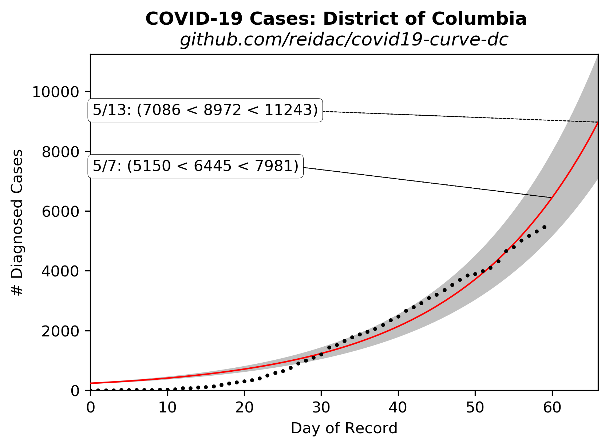

# Extrapolated COVID-19 Infections

Ported from @psteinb's excellent chart for [Dresden, Germany](https://github.com/psteinb/covid19-curve-your-city)

Then ported again from @tkphd's chart for 
[Montgomery County, Maryland](https://github.com/tkphd/covid19-curve-your-county)

## District of Columbia, USA



Data source: https://covidtracking.com/api/states/daily?state=DC

The fitting process used in this analysis gives a covariance matrix for
the model parameters, and from this matrix, it's possible to derive 
one-sigma bounds on the parameters, assuming that the uncertainty on
all of the input data points are the same. 

The gray bands are the plus-one-sigma (upper) and minus-one-sigma (lower)
deviations from the least-squares fit.


Possibly also useful, the same data fitted to a logistic functiion,
which levels out after a while.  Here the gray bands are the
highest upper and lowest lower bound from all possible one-sigma 
deviations (plus or minus) from the optimal fit.


A third figure is also available, showing the daily case increment as
a function of the total number of reported cases.  A feature of 
exponential growth is that the rate of growth of the system is 
proportional to the size of the system.  This figure visually
tests that hypothesis, and illustrates the large amount of noise
in the data.


## Reproduce This!

1. Install [Python](https://www.anaconda.com/distribution/)
2. Install dependencies

   ```bash
   $ conda install matplotlib numpy pandas scipy requests
   ```

3. Run the scripts:

   ``` 
   $ python exponential.py
   $ python logistic.py
   $ python increments.py
   ```

  These all call the the `get_dc_data.py` module to issue a GET query
to the Covid tracking site.  They generate the exponential, logistic,
and case increment vs. case count plots, respectively.

  To see the case data directly, just run `$ python get_dc_data.py`, 
it will output the list of case counts.

  All of these functions tolerate gaps in the data.

  When you modify it for your own town/county/region, you'll have
to find the appropriate data, and of course you'll want to change
the figure titles.

4. Share your findings to help others assess the spread of SARS-CoV-2, and to gauge the
   effectiveness of our collective response.
