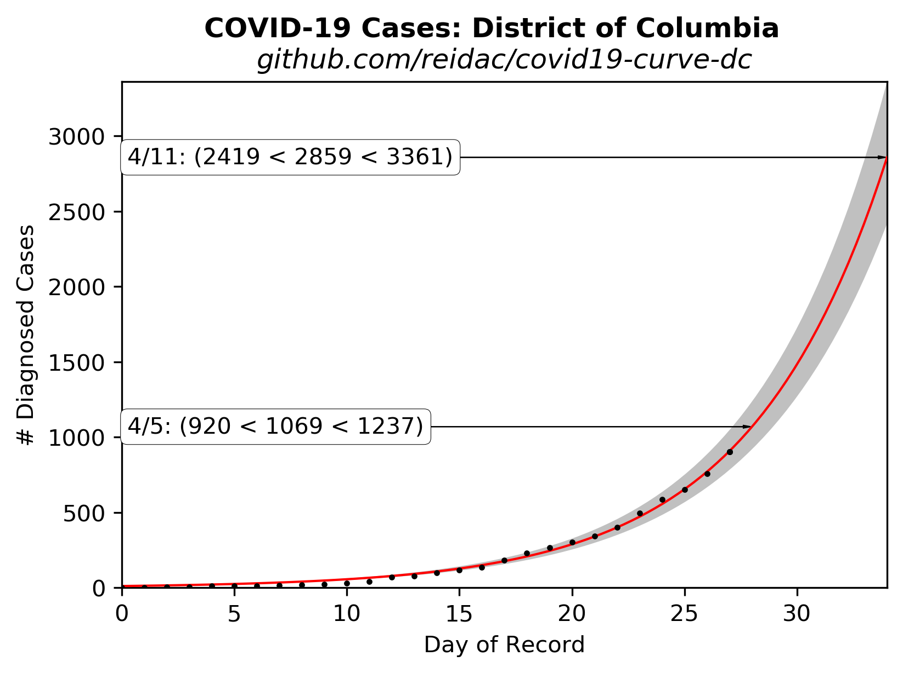

# Extrapolated COVID-19 Infections

Ported from @psteinb's excellent chart for [Dresden, Germany](https://github.com/psteinb/covid19-curve-your-city)

Then ported again from @tkphd's chart for 
[Montgomery County, Maryland](https://github.com/tkphd/covid19-curve-your-county)

## District of Columbia, USA



Data source: https://covidtracking.com/api/states/daily?state=DC

## Reproduce This!

1. Install [Python 3.6](https://www.anaconda.com/distribution/)
2. Install dependencies

   ```bash
   $ conda install matplotlib numpy pandas pip scipy
   $ pip install https://www.astro.rug.nl/software/kapteyn/kapteyn-3.0.tar.gz
   ```
I found that the default kapteyn would not install in Python 3.7 or greater, but 
I was not specifying 3.0. Your mileage may differ.

3. Run the `exponential.py` script.

   ``` 
   $ python exponential.py
   ```

  For this version, the script will make a GET query to the Covid tracking site and pull
  down the relevant data and parse the JSON. 

   Gaps in the data are OK, just provide what you have. You will want to edit the script to set the
   proper place-name and URL in the title.

4. Share your findings to help others assess the spread of SARS-CoV-2, and to gauge the
   effectiveness of our collective response.

Disclaimer: The grey bands in the generated figure should not be understood
as 95% confidence intervals even given the crudeness of the model,

Some of my tweets on this topic make this mistake, but in fact, the bands are
the result of asking the model fit for the 95% confidence bands.  This is
actually meaningless -- the model fit is generated from input data which
does not have good uncertainties, the code simply uses the default
value of 1.0 for the one-sigma error on each input point.