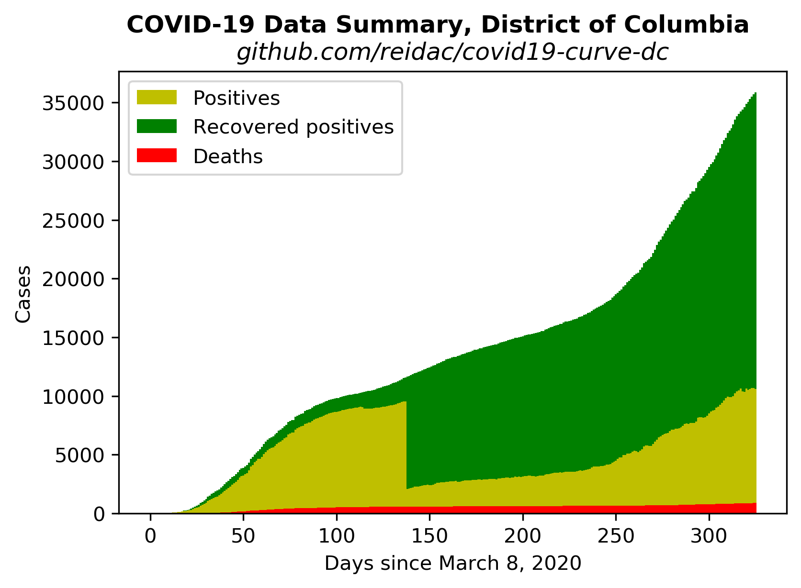
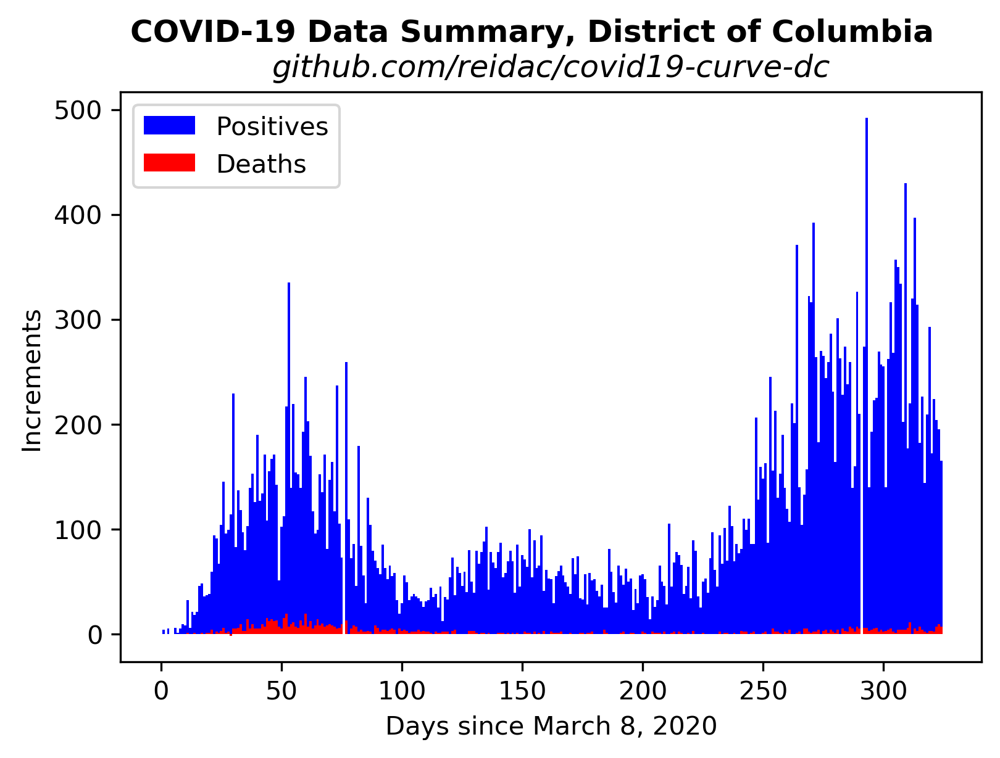
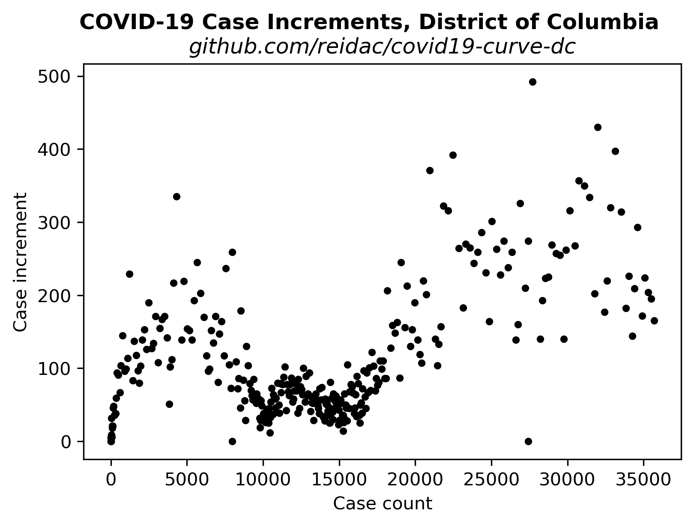

# Extrapolated COVID-19 Infections

Ported from @psteinb's excellent chart for [Dresden, Germany](https://github.com/psteinb/covid19-curve-your-city)

Then ported again from @tkphd's chart for 
[Montgomery County, Maryland](https://github.com/tkphd/covid19-curve-your-county)

## District of Columbia, USA

For all of the figures and analysis in this repo, the data
is from the CovidTracking data site and API.

Specifically, I am using the "daily" data endpoint for the
District of Columbia.

https://covidtracking.com/api/v1/states/DC/daily.json

There is a reasonably good discussion of their methodology
on [the site](https://covidtracking.com/data).

The graphics here are my own, and any errors or bugs
in the presentations are my responsibility.



This chart shows the total number of confirmed cases as
a function of time for the District of Columbia, with the
recovered and dead subsets colored separately, to possibly
help with spotting trends.




This chart shows the increments in testing, confirmed cases,
and recoveries.  The data source, as for all the analysis
here, is the CovidTracking site. 

https://covidtracking.com/api/v1/states/DC/daily.json




The daily case increment as
a function of the total number of reported cases.  A feature of 
exponential growth is that the rate of growth of the system is 
proportional to the size of the system.  This figure visually
tests that hypothesis, and illustrates the large amount of noise
in the data.  The exponential trend had some hope of validity
in the early days, but now is obviously absent.


## Reproduce This!

1. Install [Python](https://www.anaconda.com/distribution/)
2. Install dependencies

   ```bash
   $ conda install matplotlib numpy pandas scipy requests
   ```

3. Run the scripts:

   ``` 
   $ python bars.py
   $ python increments.py
   $ python logistic.py
   $ python exponential.py
   ```

  These all call the the `get_dc_data.py` module to issue a GET query
to the Covid tracking site.  They generate the bar chart, the case
increment vs. case count plot, and logistic and exponential fits
to the data, respectively.  The exponential fit is not depicted
above, as it's well outside its domain of validity at this point.

  To see the case data directly, just run `$ python get_dc_data.py`, 
it will output the list of total tests, positive tests, and 
recoveries, as Python lists.

  All of these functions tolerate gaps in the data.

  When you modify it for your own town/county/region, you'll have
to find the appropriate data, and of course you'll want to change
the figure titles.

4. Share your findings to help others assess the spread of SARS-CoV-2, and to gauge the
   effectiveness of our collective response.
