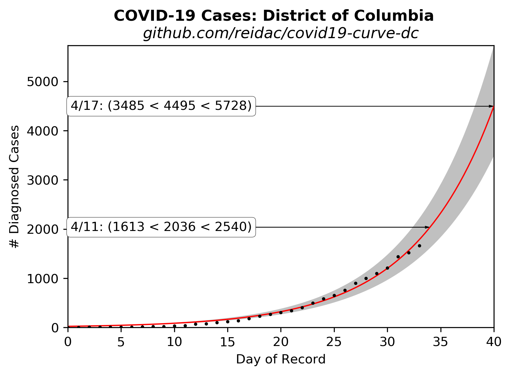

# Extrapolated COVID-19 Infections

Ported from @psteinb's excellent chart for [Dresden, Germany](https://github.com/psteinb/covid19-curve-your-city)

Then ported again from @tkphd's chart for 
[Montgomery County, Maryland](https://github.com/tkphd/covid19-curve-your-county)

## District of Columbia, USA



Data source: https://covidtracking.com/api/states/daily?state=DC

## Reproduce This!

1. Install [Python](https://www.anaconda.com/distribution/)
2. Install dependencies

   ```bash
   $ conda install matplotlib numpy pandas pip scipy
   ```

3. Run the `exponential.py` script.

   ``` 
   $ python exponential.py
   ```

  For this version, the script will make a GET query to the Covid tracking site and pull
  down the relevant data and parse the JSON. 

   Gaps in the data are OK, just provide what you have. You will want to edit the script to set the
   proper place-name and URL in the title.

4. Share your findings to help others assess the spread of SARS-CoV-2, and to gauge the
   effectiveness of our collective response.

*Disclaimer:*  The gray band is an estimate of the uncertainty, but not 
a hugely good one.  It's based on a one-sigma standard error of 1.0 for
the data points, which is arbitrary, the true error is unknown. 
