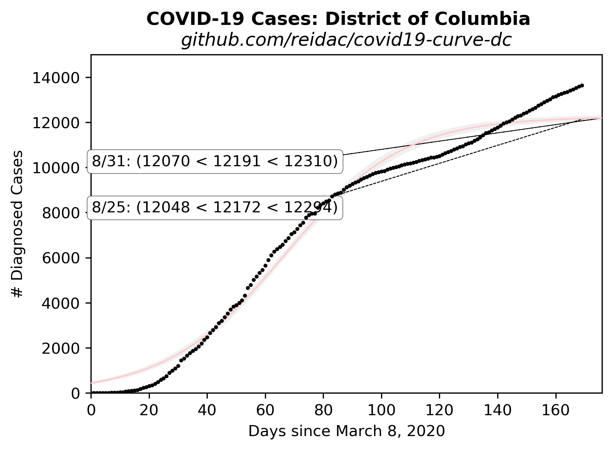

# Extrapolated COVID-19 Infections

Ported from @psteinb's excellent chart for [Dresden, Germany](https://github.com/psteinb/covid19-curve-your-city)

Then ported again from @tkphd's chart for 
[Montgomery County, Maryland](https://github.com/tkphd/covid19-curve-your-county)

## District of Columbia, USA


This chart shows the increments in testing, confirmed cases,
and recoveries.  The data source, as for all the analysis
here, is the CovidTracking site. 

https://covidtracking.com/api/v1/states/DC/daily.json


The daily case increment as
a function of the total number of reported cases.  A feature of 
exponential growth is that the rate of growth of the system is 
proportional to the size of the system.  This figure visually
tests that hypothesis, and illustrates the large amount of noise
in the data.  The exponential trend had some hope of validity
in the early days, but now is obviously absent.




Cumulative case data fitted to a logistic function.  The model fit is
increasingly ridiculous, but it's possibly a useful supplement to
the cumulative case data, which for the past month or so
(as of early May, 2020) has been trending more or less
linearly. 

The fitting process used in this analysis gives a covariance matrix for
the model parameters, and from this matrix, it's possible to derive 
one-sigma bounds on the parameters, assuming that the uncertainty on
all of the input data points are the same. 

The gray bands are the plus-one-sigma (upper) and minus-one-sigma (lower)
deviations from the least-squares fit.


## Reproduce This!

1. Install [Python](https://www.anaconda.com/distribution/)
2. Install dependencies

   ```bash
   $ conda install matplotlib numpy pandas scipy requests
   ```

3. Run the scripts:

   ``` 
   $ python bars.py
   $ python increments.py
   $ python logistic.py
   $ python exponential.py
   ```

  These all call the the `get_dc_data.py` module to issue a GET query
to the Covid tracking site.  They generate the bar chart, the case
increment vs. case count plot, and logistic and exponential fits
to the data, respectively.  The exponential fit is not depicted
above, as it's well outside its domain of validity at this point.

  To see the case data directly, just run `$ python get_dc_data.py`, 
it will output the list of total tests, positive tests, and 
recoveries, as Python lists.

  All of these functions tolerate gaps in the data.

  When you modify it for your own town/county/region, you'll have
to find the appropriate data, and of course you'll want to change
the figure titles.

4. Share your findings to help others assess the spread of SARS-CoV-2, and to gauge the
   effectiveness of our collective response.
